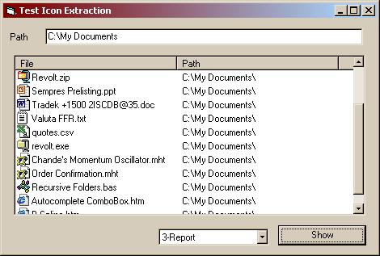

<div align="center">

## Ariel file icon extractor


</div>

### Description

This project demonstrates how to extract large and small icons associated with files into an imagelist and displaying them in a listview with

the filenames. The SHGetFileInfo function of the shell32.dll library is used, which makes the job much easier than before. The ImageList_Draw

function in comctl32.dll is used to draw the icon in a picture box,from where it is placed into the image list. Other submissions on PSC do an OK job on large icons, but the small icons are a mess. Not here! Credits to Peter Meier for his DelRecent posting.
 
### More Info
 
ImageList can't hold more than 400 icons, so check duplicates.


<span>             |<span>
---                |---
**Submitted On**   |2000-12-23 03:47:30
**By**             |[Tom de Lange](https://github.com/Planet-Source-Code/PSCIndex/blob/master/ByAuthor/tom-de-lange.md)
**Level**          |Intermediate
**User Rating**    |5.0 (130 globes from 26 users)
**Compatibility**  |VB 5\.0, VB 6\.0
**Category**       |[Files/ File Controls/ Input/ Output](https://github.com/Planet-Source-Code/PSCIndex/blob/master/ByCategory/files-file-controls-input-output__1-3.md)
**World**          |[Visual Basic](https://github.com/Planet-Source-Code/PSCIndex/blob/master/ByWorld/visual-basic.md)
**Archive File**   |[CODE\_UPLOAD1295912222000\.zip](https://github.com/Planet-Source-Code/tom-de-lange-ariel-file-icon-extractor__1-13803/archive/master.zip)

### API Declarations

```
SHGetFileInfo() in shell32.dll
ImageList_Draw() in comctl32.dll
```


